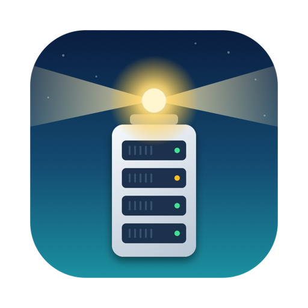

<p align="center"></p>

# Architecture

Unraid Watcher is a single-target Swift Package that builds a SwiftUI macOS app. It has no third-party dependencies. It uses only Apple frameworks (SwiftUI, Charts, AppKit, Security, UserNotifications, Foundation).

## Project layout

```
Package.swift                    Swift package (macOS 14, one executable target)
build_app.sh                     Builds and signs "Unraid Watcher.app"
make_dmg.sh                      Builds the DMG installer
Resources/AppIcon.icns           App icon
tools/make_icon.swift            Draws the icon and writes the .icns
tools/make_dmg_bg.swift          Draws the DMG window background
tools/make_docs_pdf.py            Builds the documentation PDF from the markdown files
docs/assets/icon.png             App icon used in the docs and the PDF cover
docs/Unraid-Watcher-Documentation.pdf   The combined documentation
Sources/UnraidWatcher/
  App.swift                      App entry, scenes, About panel, settings migration
  Client.swift                   GraphQL client, API models, Keychain helper
  Servers.swift                  Server profiles, ServerManager, server picker, overview, menu bar, Settings
  Store.swift                    State, polling loop, and alerts for one server
  Remote.swift                   SSH execution and parsing of server output
  Actions.swift                  Actions (API and SSH), SMART models and parser
  LoginItem.swift                Launch at login and quiet start in the menu bar
  Deluge.swift                   Deluge Web UI client, models, and the Deluge panel
  ArrayOperation.swift           Progress of a rebuild, parity build, or check, and the card that shows it
  Spread.swift                   Share spread: per-disk measuring and the spread view
  CacheCleanup.swift             Empty-folder scan and delete scripts, and the clean-up sheet
  StrayFiles.swift               Finding cache files that are already on the array, and the verified delete
  ShareVM.swift                  Share management and VM detail views
  VMEditor.swift                 VM creation, XML generation, edit sheet
  VMExtras.swift                 VM clone planning, media, console
  Views.swift                    Sidebar, all tab views, menu bar, settings
```

## Data flow

```
        +------------------+
        |  Unraid server   |
        +--------+---------+
      GraphQL    |    SSH
   (URLSession)  |  (/usr/bin/ssh)
        +--------v---------+
        |  Store           |  @MainActor ObservableObject
        |  polling loop    |
        +--------+---------+
                 | @Published state
        +--------v---------+
        |  SwiftUI views   |
        +------------------+
```

### Servers

`ServerManager` owns the list of `ServerProfile` values (name, URL, SSH settings), saved as JSON in preferences, with each server's API key and SSH password in its own Keychain items. It creates one `Store` per server and starts every one, so all servers poll and alert in the background. It also tracks which server is selected, rebuilds a server's store when its settings are saved, and migrates the old single-server settings on first launch.

The window shows the selected server's `Store` through the SwiftUI environment, so the existing views did not need to know about multiple servers. `AllServersView` and the menu bar read every store directly.

### The Store

Each `Store` is the source of truth for one server. A `Task` loop calls `refresh()` every N seconds.

- **API data:** each GraphQL query runs as its own concurrent task (`async let`). Each returns a `Result`, so a failing query records an entry in the `errors` dictionary without affecting the others. Views show errors relevant to the current tab; errors for optional extras are grouped into a collapsed notice.
- **SSH data:** if SSH is enabled, one `ssh` call fetches many sections at once. The output is parsed into a `RemoteSample`. Rates (network, disk I/O, per-core CPU) are computed from the difference between the current and previous samples and the elapsed time.
- **History:** short arrays (the last 60 samples) feed the sparkline charts.
- **Alerts:** after each refresh, `checkAlerts()` compares temperatures and notifications against thresholds and sends macOS notifications. A small state machine with hysteresis prevents repeats.
- **SMART:** loaded separately every 30 minutes when SSH is on, or on demand.

### Talking to the server

- `UnraidClient` (in `Client.swift`) posts GraphQL documents with an `x-api-key` header. It tolerates self-signed certificates only when the setting is on. Responses decode through `Envelope<T>`, and numeric fields that Unraid sometimes returns as strings decode through the `Flex` and `LStr` types.
- `Remote.exec` (in `Remote.swift`) runs `/usr/bin/ssh` as a subprocess and sends the script on standard input to `sh -s`. Standard error is drained on a separate thread to avoid pipe deadlocks. A cancelled task stops its ssh process and returns to the caller at once, even though a shared connection keeps the command's output open, which is how the Stop buttons work. The command already running on the server finishes by itself, so long scans run at idle priority with a time limit. It shares one authenticated connection between commands (`ControlMaster=auto`, kept alive for two minutes, with the socket in a private `/tmp/uw-<uid>` folder), so there is one login rather than one per refresh. In key mode it uses batch mode. In password mode it uses a temporary `SSH_ASKPASS` helper that reads the password from an environment variable. `ServerAliveInterval` keeps long operations such as VM cloning connected.
- Anything interpolated into a shell script goes through `shq()` (single-quote escaping), and names, paths, and device names are validated first (`validShareName`, `validPath`, `validDev`).

### Deluge

`DelugeClient` speaks JSON-RPC to the Deluge Web UI with its own `URLSession`, which keeps the login cookie. It logs in again automatically when the session expires, attaches the Web UI to the daemon if needed, and falls back to older method names for pause and resume. The `Store` creates a client per server (rebuilt when the address or password changes) and detects Deluge from the Docker container list. The panel polls only while it is on screen.

### Parsers and generators

These are written as pure functions so they are easy to test in isolation:

| Function | Purpose |
|----------|---------|
| `Remote.parse` | Turns the batched SSH output into a `RemoteSample` |
| `Smart.parse` | Turns `smartctl -j` JSON into a `SmartInfo` with a health verdict |
| `Store.parseCfg` | Parses Unraid share `.cfg` files |
| `domainXML` | Generates a libvirt domain definition for a new VM |
| `createScript` | Builds the shell script that creates a VM and cleans up on failure |
| `planClone` | Computes the XML and file copies needed to clone a VM |
| `cleanupScanScript`, `parseEmptyRoots` | Build the read-only empty-folder scan and parse its output |
| `cleanupDeleteScript`, `validCleanupPath` | Build the delete step and check every path stays inside the pool |
| `ArrayOperation.from` | Turns the array state values into an operation with a title, progress, and what it means for your data |
| `strayScanScript`, `parseStrayScan` | Find cache files that also exist on an array disk, and whether they match |
| `strayDeleteScript` | Re-verify each file against its array copy, byte for byte, and remove only those that still match |
| `spreadLocationsScript`, `parseSpreadLocations` | Find where a share lives, skipping merged views and unassigned devices |
| `DelugeParse.snapshot` | Turns a Deluge `web.update_ui` result into torrents and statistics |

The project does not yet include an automated test target. During development these functions were checked with throwaway harnesses (sample inputs, `xmllint`, and stand-in `virsh` and `qemu-img` scripts). Turning them into XCTest cases is a good next step.

## UI structure

- `ContentView` is a `NavigationSplitView`. The sidebar lists sections, and the detail area switches on the selected `Section`.
- A banner at the top of the detail area shows action results.
- `ErrorsPanel` decides which errors are shown on which tab.
- Reusable pieces: `Card`, `UsageBar`, `Pill`, `Spark`.
- Sheets handle multi-field flows: share editor, VM create, VM edit, VM clone, VM details, container logs.
- `MenuBarExtra` provides the menu bar item. `Settings` provides the preferences window.

## Security design

- Secrets (API key, SSH password) are stored in the Keychain, separately for each server.
- The SSH password reaches `ssh` only through an environment variable read by a helper script, so it is not written to disk or shown in process arguments.
- Destructive operations require explicit confirmation in the UI.
- The app connects only to the address you enter.

## Adding a feature

1. Add the data model and a query or script. Prefer a separate, isolated query so a failure does not break other panels.
2. Add `@Published` state to `Store` and fill it in `refresh()` (or load it on demand from an action).
3. If it can fail, give it an error key, and decide in `ErrorsPanel` and `relevant(_:)` where it should show.
4. Add the view, and a sidebar `Section` if it needs its own tab.
5. For anything destructive, add a confirmation dialog.
6. Document the new queries or commands in [Data sources](data-sources.md).

© 2026 Ray Munro. Licensed under the GNU General Public License v3.0 or later.
